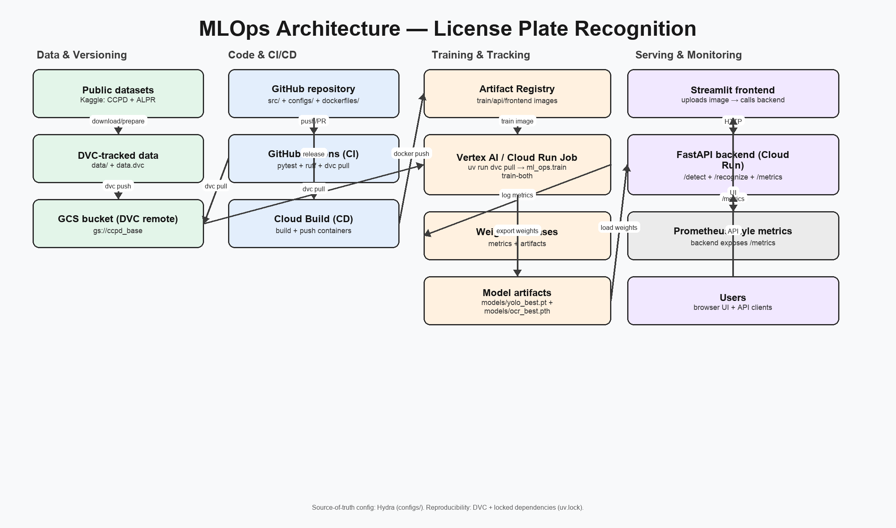

## Architecture

### What runs where

- **Local dev**
  - You iterate on code, configs, and tests.
  - You can train/evaluate locally on `data/ccpd_tiny` or pull the full dataset via DVC.
- **CI (GitHub Actions)**
  - Runs tests + linting and (when configured) validates data access via `dvc pull`.
- **Cloud training (Vertex AI / Cloud Run Job)**
  - Runs a containerized training entrypoint that pulls the DVC dataset and executes `ml_ops.train`.
  - Logs metrics to Weights & Biases.
- **Serving (Cloud Run)**
  - FastAPI backend exposes `/detect`, `/recognize`, `/health`, `/metrics`.
  - Streamlit frontend calls the backend and renders annotated results.

### Data and model artifacts

- **Data versioning**
  - The `data/` directory is tracked by DVC (`data.dvc`) and stored remotely in a GCS bucket.
- **Model outputs**
  - Detector weights are exported to `models/yolo_best.pt`.
  - Fine-tuned EasyOCR OCR weights are exported to `models/ocr_best.pth`.
