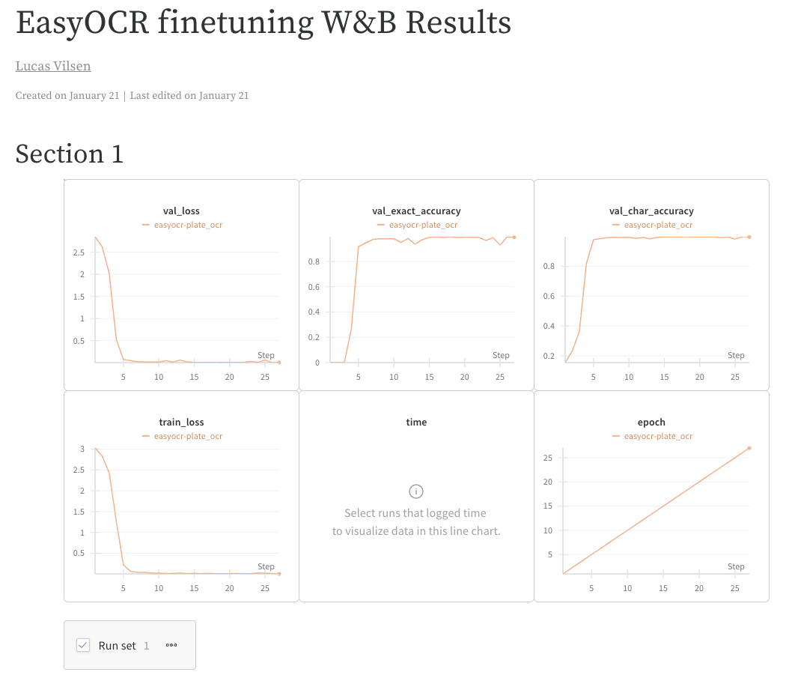
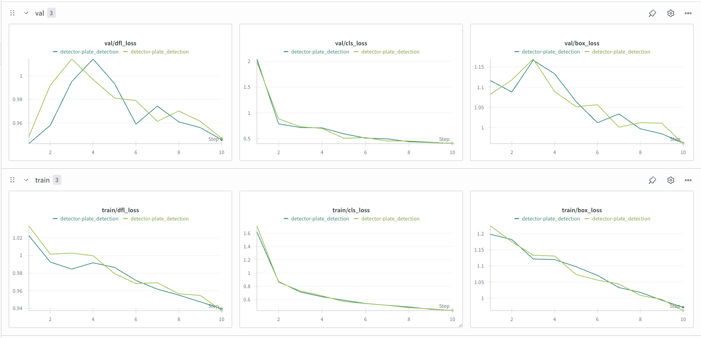
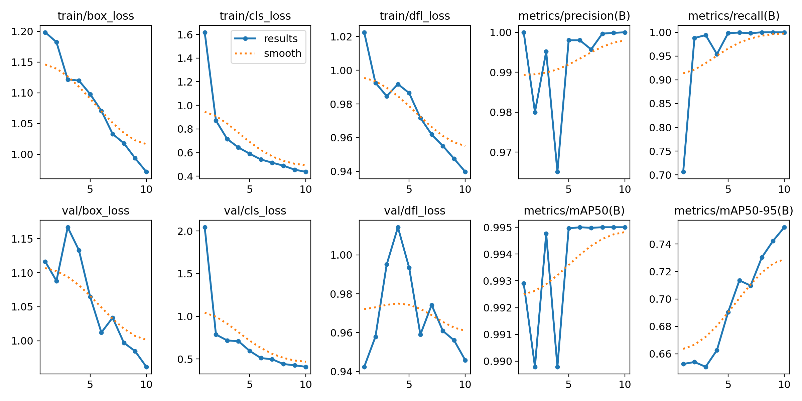
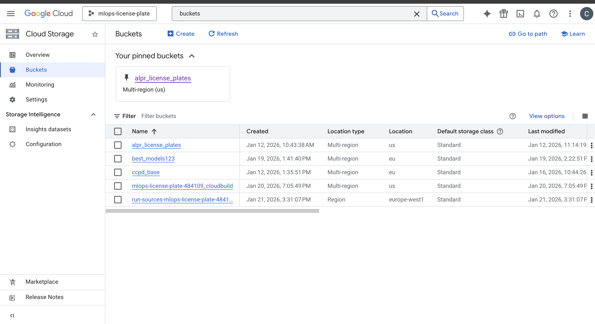
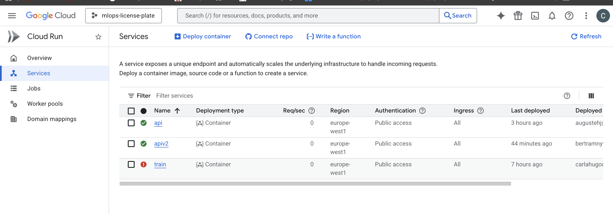
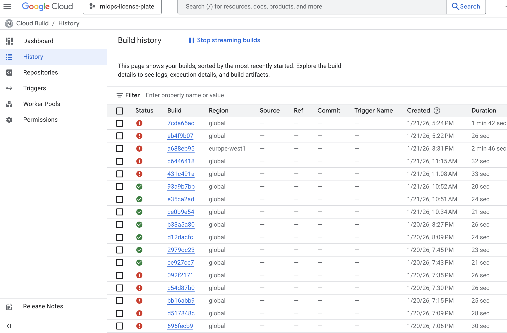
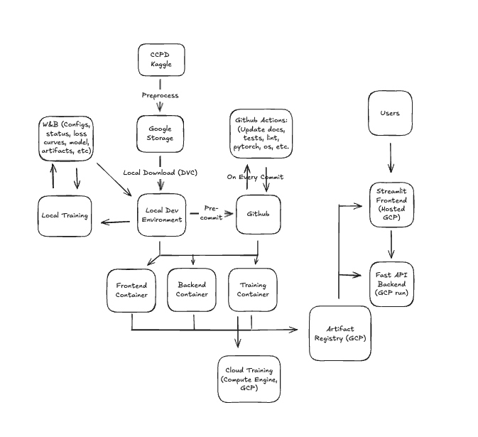

# Exam template for 02476 Machine Learning Operations

This is the report template for the exam. Please only remove the text formatted as with three dashes in front and behind
like:

```--- question 1 fill here ---```

Where you instead should add your answers. Any other changes may have unwanted consequences when your report is
auto-generated at the end of the course. For questions where you are asked to include images, start by adding the image
to the `figures` subfolder (please only use `.png`, `.jpg` or `.jpeg`) and then add the following code in your answer:

``

In addition to this markdown file, we also provide the `report.py` script that provides two utility functions:

Running:

```bash
python report.py html
```

Will generate a `.html` page of your report. After the deadline for answering this template, we will auto-scrape
everything in this `reports` folder and then use this utility to generate a `.html` page that will be your serve
as your final hand-in.

Running

```bash
python report.py check
```

Will check your answers in this template against the constraints listed for each question e.g. is your answer too
short, too long, or have you included an image when asked. For both functions to work you mustn't rename anything.
The script has two dependencies that can be installed with

```bash
pip install typer markdown
```

or

```bash
uv add typer markdown
```

## Overall project checklist

The checklist is *exhaustive* which means that it includes everything that you could do on the project included in the
curriculum in this course. Therefore, we do not expect at all that you have checked all boxes at the end of the project.
The parenthesis at the end indicates what module the bullet point is related to. Please be honest in your answers, we
will check the repositories and the code to verify your answers.

### Week 1

* [x] Create a git repository (M5)
* [x] Make sure that all team members have write access to the GitHub repository (M5)
* [x] Create a dedicated environment for you project to keep track of your packages (M2)
* [x] Create the initial file structure using cookiecutter with an appropriate template (M6)
* [x] Fill out the `data.py` file such that it downloads whatever data you need and preprocesses it (if necessary) (M6)
* [x] Add a model to `model.py` and a training procedure to `train.py` and get that running (M6)
* [x] Remember to either fill out the `requirements.txt`/`requirements_dev.txt` files or keeping your
    `pyproject.toml`/`uv.lock` up-to-date with whatever dependencies that you are using (M2+M6)
* [x] Remember to comply with good coding practices (`pep8`) while doing the project (M7)
* [x] Do a bit of code typing and remember to document essential parts of your code (M7)
* [x] Setup version control for your data or part of your data (M8)
* [x] Add command line interfaces and project commands to your code where it makes sense (M9)
* [x] Construct one or multiple docker files for your code (M10)
* [x] Build the docker files locally and make sure they work as intended (M10)
* [x] Write one or multiple configurations files for your experiments (M11)
* [x] Used Hydra to load the configurations and manage your hyperparameters (M11)
* [x] Use profiling to optimize your code (M12)
* [x] Use logging to log important events in your code (M14)
* [x] Use Weights & Biases to log training progress and other important metrics/artifacts in your code (M14)
* [x] Consider running a hyperparameter optimization sweep (M14)
* [x] Use PyTorch-lightning (if applicable) to reduce the amount of boilerplate in your code (M15)

### Week 2

* [x] Write unit tests related to the data part of your code (M16)
* [x] Write unit tests related to model construction and or model training (M16)
* [x] Calculate the code coverage (M16)
* [x] Get some continuous integration running on the GitHub repository (M17)
* [x] Add caching and multi-os/python/pytorch testing to your continuous integration (M17)
* [x] Add a linting step to your continuous integration (M17)
* [x] Add pre-commit hooks to your version control setup (M18)
* [x] Add a continues workflow that triggers when data changes (M19)
* [x] Add a continues workflow that triggers when changes to the model registry is made (M19)
* [x] Create a data storage in GCP Bucket for your data and link this with your data version control setup (M21)
* [x] Create a trigger workflow for automatically building your docker images (M21)
* [x] Get your model training in GCP using either the Engine or Vertex AI (M21)
* [x] Create a FastAPI application that can do inference using your model (M22)
* [ ] Deploy your model in GCP using either Functions or Run as the backend (M23)
* [x] Write API tests for your application and setup continues integration for these (M24)
* [ ] Load test your application (M24)
* [] Create a more specialized ML-deployment API using either ONNX or BentoML, or both (M25)
* [x] Create a frontend for your API (M26)

### Week 3

* [ ] Check how robust your model is towards data drifting (M27)
* [ ] Setup collection of input-output data from your deployed application (M27)
* [ ] Deploy to the cloud a drift detection API (M27)
* [ ] Instrument your API with a couple of system metrics (M28)
* [ ] Setup cloud monitoring of your instrumented application (M28)
* [ ] Create one or more alert systems in GCP to alert you if your app is not behaving correctly (M28)
* [x] If applicable, optimize the performance of your data loading using distributed data loading (M29)
* [x] If applicable, optimize the performance of your training pipeline by using distributed training (M30)
* [x] Play around with quantization, compilation and pruning for you trained models to increase inference speed (M31)

### Extra

* [x] Write some documentation for your application (M32)
* [x] Publish the documentation to GitHub Pages (M32)
* [ ] Revisit your initial project description. Did the project turn out as you wanted?
* [x] Create an architectural diagram over your MLOps pipeline
* [x] Make sure all group members have an understanding about all parts of the project
* [x] Uploaded all your code to GitHub

## Group information

### Question 1
> **Enter the group number you signed up on <learn.inside.dtu.dk>**
>
> Answer:

*Group 60*

### Question 2
> **Enter the study number for each member in the group**
>
> Example:
>
> *sXXXXXX, sXXXXXX, sXXXXXX*
>
> Answer:

*s224209, s224166, s224194, s224195*

### Question 3
> **Did you end up using any open-source frameworks/packages not covered in the course during your project? If so**
> **which did you use and how did they help you complete the project?**
>
> Recommended answer length: 0-200 words.
>
> Example:
> *We used the third-party framework ... in our project. We used functionality ... and functionality ... from the*
> *package to do ... and ... in our project*.
>
> Answer:

*We used the Ultralytics and EasyOCR opensource frameworks for training of yolo/detr models and finetuning of ocr models for various languages respectively. We first tried implemented parts of the OCR model ourselves, but couldn't get good results. Using Yolov8n from Ultralytics and finetuning EasyOCR helped massively with respect to all the training code, model tuning and general performance, so that we could spend our time on the mlops part of the project.*

## Coding environment

> In the following section we are interested in learning more about you local development environment. This includes
> how you managed dependencies, the structure of your code and how you managed code quality.

### Question 4

> **Explain how you managed dependencies in your project? Explain the process a new team member would have to go**
> **through to get an exact copy of your environment.**
>
> Recommended answer length: 100-200 words
>
> Example:
> *We used ... for managing our dependencies. The list of dependencies was auto-generated using ... . To get a*
> *complete copy of our development environment, one would have to run the following commands*
>
> Answer:

*We used uv for managing our dependencies. The list of dependencies was auto-generated using uv add <package> . To get a*
*complete copy of our development environment, one would have to run the following commands*

```bash
uv sync
```
*This would install all the dependencies listed in the uv.lock file to create an exact copy of our development environment.*
*Dependencies are listed in the pyproject.toml file, with the exact versions listed in the uv.lock file.*

*Lastly, a new member should install the pre-commit hooks by running:*

```bash
pre-commit install
```

*Pre-commit will help run all the github actions and various checks locally and speed up the loop much faster when developing new code, so this too is crucial for new people*

### Question 5

> **We expect that you initialized your project using the cookiecutter template. Explain the overall structure of your**
> **code. What did you fill out? Did you deviate from the template in some way?**
>
> Recommended answer length: 100-200 words
>
> Example:
> *From the cookiecutter template we have filled out the ... , ... and ... folder. We have removed the ... folder*
> *because we did not use any ... in our project. We have added an ... folder that contains ... for running our*
> *experiments.*
>
> Answer:

*From the cookiecutter template we have filled out the train.py, model.py, data.py, evaluate.py, api.py, visualize.py, and the tests, dockerfiles folders. We have added a range of different config folders that contains config files for our hydra setup for running our training experiments under the "config" folder*

*Besides we haven't changed much from the original structure, as we haven't found missing functionality. One of things we initially debated was whether to move the src files directly into the src/ folder instead of having the ml_ops secondary folder, which feels a bit redundant in our case. We kept things as is, as it didn't really matter, but probably something we would consider in the future. We also added a runs/ folder for logging our local runs and investigating locally before pushing code to cloud and waiting for training runs there as that makes the iteration loop extremely slow*

### Question 6

> **Did you implement any rules for code quality and format? What about typing and documentation? Additionally,**
> **explain with your own words why these concepts matters in larger projects.**
>
> Recommended answer length: 100-200 words.
>
> Example:
> *We used ... for linting and ... for formatting. We also used ... for typing and ... for documentation. These*
> *concepts are important in larger projects because ... . For example, typing ...*
>
> Answer:

*We enforced code quality with Ruff for linting and formatting, and pre-commit hooks to keep the codebase consistent. For typing and documentation we have not used any strict guidelines. However, for larger projects, these concepts are important because they ensure easier maintainability and collaboration, thus efficiency. It ensures that cross team coworkers easily can read, understand and write code without introducing foreign errors. In addition to this we added automatic testing on precommit to ensure assumptions and basic functionality didn't break. We did have some issues with the tests as it is limited what can be tested locally vs on CI (example: Linux vs MAC vs Windows), so we tried to test as many functionalities as possible here and then accepted that some cases might be different on various OS, which would then be caught in CI.*

## Version control

> In the following section we are interested in how version control was used in your project during development to
> corporate and increase the quality of your code.

### Question 7

> **How many tests did you implement and what are they testing in your code?**
>
> Recommended answer length: 50-100 words.
>
> Example:
> *In total we have implemented X tests. Primarily we are testing ... and ... as these the most critical parts of our*
> *application but also ... .*
>
> Answer:

*We implemented 67 tests across data, model, training, evaluation, profiling, and API. For training we mainly validate Hydra config handling, data.yaml generation, and that detector/OCR training helpers are invoked (mocked) without running full training. For models we test forward passes and decoding to ensure correct output shapes. For data we test CCPD filename parsing, dataset/dataloader behavior, and YOLO export creating image/label files. For evaluation we test metric utilities. For the API we test endpoints with valid and invalid inputs.*

### Question 8

> **What is the total code coverage (in percentage) of your code? If your code had a code coverage of 100% (or close**
> **to), would you still trust it to be error free? Explain you reasoning.**
>
> Recommended answer length: 100-200 words.
>
> Example:
> *The total code coverage of code is X%, which includes all our source code. We are far from 100% coverage of our **
> *code and even if we were then...*
>
> Answer:

*[This image](figures/test-coverage.png) shows the coverage across the src files. It spans from 7-100% depending on, how much of the code we could test and made sense to test. Obviously, you could always go for a higher amount of coverage and more testing scenarios, which is always a trade-off. We made a rather small amount of tests in the beginning to test simple model passes, data types and various assumptions, and then added regression tests as we found bugs and improved our model. Just because coverage is high (the lines are being hit in a test), errors should for sure still happen. Having some tests for all your code is probably good, but only if they test actual scenarios and not redundant scenarios.*

### Question 9

> **Did you workflow include using branches and pull requests? If yes, explain how. If not, explain how branches and**
> **pull request can help improve version control.**
>
> Recommended answer length: 100-200 words.
>
> Example:
> *We made use of both branches and PRs in our project. In our group, each member had an branch that they worked on in*
> *addition to the main branch. To merge code we ...*
>
> Answer:

*We made use of both branches and PRs in our project. We included branch protection rules for our main branch. In our group, we had feature branches for different tasks, meaning that no member had their own branch, but would make a new called fx unit_testing, to implement unit tests. Then it would need to pass some tests and a merge control before merging would be possible. We could have added minimum 1 reviewer to merge the PR, but we thought it would be too much work for our group to review each other. For larger projects it is a good idea to get at least 1 reviewer on PRs to avoid stupid mistakes and sole liability.*

### Question 10

> **Did you use DVC for managing data in your project? If yes, then how did it improve your project to have version**
> **control of your data. If no, explain a case where it would be beneficial to have version control of your data.**
>
> Recommended answer length: 100-200 words.
>
> Example:
> *We did make use of DVC in the following way: ... . In the end it helped us in ... for controlling ... part of our*
> *pipeline*
>
> Answer:

*Yes. We used DVC to version the dataset and it was stored in a bucket in remote storage using Google Cloud Storage. For this project it was not strictly necessary to use version control for the data, since it was static. However, for projects where a model should be checkpointed and retrained as new data arrives, it could be very useful, moreover, if it is important to know what data something is trained on, versioning is also beneficial, because then we could say that we know that this model did or did not know X, i.e. it enhances reproducibility and helps setting up new people to the project. We experienced this when setting up the project in week 3 on a new pc and needed to download everything. This was a benefit we didn't realize at first. Additionally, we manually uploaded our trained models to a bucket in Google Cloud, but we did not manage to include them in DVC. Integrating model files into DVC would have further improved reproducibility.*

### Question 11

> **Discuss you continuous integration setup. What kind of continuous integration are you running (unittesting,**
> **linting, etc.)? Do you test multiple operating systems, Python  version etc. Do you make use of caching? Feel free**
> **to insert a link to one of your GitHub actions workflow.**
>
> Recommended answer length: 200-300 words.
>
> Example:
> *We have organized our continuous integration into 3 separate files: one for doing ..., one for running ... testing*
> *and one for running ... . In particular for our ..., we used ... .An example of a triggered workflow can be seen*
> *here: <weblink>*
>
> Answer:

*We run several GitHub Actions workflows in .github/workflows/ to cover testing, linting, and targeted checks. Our main CI pipeline is tests.yaml, which runs pytest (with coverage) in a matrix across Ubuntu/Windows/macOS, Python 3.11 + 3.12, and multiple CPU PyTorch versions (2.5.1 and 2.6.0) to catch cross-platform and version-specific regressions early. To keep CI fast, we use caching for uv + pip (~/.cache/uv, ~/.cache/pip), DVC artifacts (.dvc/cache), and model/ML caches (~/.cache/torch, ~/.EasyOCR).*

*For code quality, we have a dedicated linting.yaml workflow that runs Ruff linting and formatting checks, and a separate pre-commit.yaml workflow that runs the full pre-commit hook set (also caching the pre-commit environment). We additionally use targeted workflows to avoid running everything on every change: data-change.yaml triggers only for dataset/DVC changes and runs data-focused tests, and model-registry.yaml triggers for model/config changes and runs model checks. Finally, docker-build.yaml validates that Docker images build in CI, and build_api.yaml is a manually triggered build/deploy workflow for the API. (See examples of our actions running here. These actions run on each PR and commit to main to ensure the code is always up to date. At time of writing this we run 15 different test that is all required to succeed for a PR to be merged: https://github.com/Apros7/ml_ops_project/actions)*


## Running code and tracking experiments

> In the following section we are interested in learning more about the experimental setup for running your code and
> especially the reproducibility of your experiments.

### Question 12

> **How did you configure experiments? Did you make use of config files? Explain with coding examples of how you would**
> **run a experiment.**
>
> Recommended answer length: 50-100 words.
>
> Example:
> *We used a simple argparser, that worked in the following way: Python  my_script.py --lr 1e-3 --batch_size 25*
>
> Answer:

We configure experiments with Hydra YAML configs in configs/. The main config (configs/config.yaml) composes modular groups (data/model/training/W&B), and ml_ops.train loads them via load_hydra_config(...). We have picked default parameters in the train file which gives good results. This can be overwritten if needed with --override/-o flags. We found this to be good enough, although we could've spent more time making the config files better, more direct and easier to use. Everything is logged to wandb to use later when analyzing trainings.
Example run:
```
uv run python -m ml_ops.train train-detector data/ccpd_tiny \
  --override training/detector=fast --override model/detector=yolov8s --name exp-y8s-fast
```


### Question 13

> **Reproducibility of experiments are important. Related to the last question, how did you secure that no information**
> **is lost when running experiments and that your experiments are reproducible?**
>
> Recommended answer length: 100-200 words.
>
> Example:
> *We made use of config files. Whenever an experiment is run the following happens: ... . To reproduce an experiment*
> *one would have to do ...*
>
> Answer:

We ensured reproducibility by versioning inputs, pinning the environment, and logging outputs. Experiments are
configured via Hydra YAML configs in `configs/` and overrides passed on the CLI; the chosen hyperparameters are stored
in the W&B run config together with metrics. Each training run also writes artifacts locally under `runs/` (Ultralytics
`results.csv`/plots for detection, PyTorch Lightning CSV logs + checkpoints for OCR) and we copy the best weights into
`models/` (`yolo_best.pt`, `ocr_best.pth`). The dataset is tracked with DVC (`data.dvc`) and stored in a GCS remote, so
`uv run dvc pull` retrieves the exact data/splits used. Dependencies are locked via `pyproject.toml` + `uv.lock`, and
we provide Docker images for identical execution in CI/GCP. To reproduce a run: checkout the same git commit, run
`uv run dvc pull`, then rerun `uv run python -m ml_ops.train ...` with the same Hydra overrides (available from the W&B
run page).

### Question 14

> **Upload 1 to 3 screenshots that show the experiments that you have done in W&B (or another experiment tracking**
> **service of your choice). This may include loss graphs, logged images, hyperparameter sweeps etc. You can take**
> **inspiration from [this figure](figures/wandb.png). Explain what metrics you are tracking and why they are**
> **important.**
>
> Recommended answer length: 200-300 words + 1 to 3 screenshots.
>
> Example:
> *As seen in the first image when have tracked ... and ... which both inform us about ... in our experiments.*
> *As seen in the second image we are also tracking ... and ...*
>
> Answer:

The first image shows the EasyOCR report on W&B for our best run so far: .
The second image shows the tracking of our detection run (yolo) in W&B: .
The last image shows the results of one of our detections runs (yolo). This is generated locally, then uploaded to W&B when the training is done: .

Generally, we upload all the useful information to W&B, including configs, training loss(es), val loss(es) and system metrics.

For the OCR model (first image), we track `train_loss` and `val_loss` to verify convergence and detect overfitting (e.g.,training loss dropping while validation loss increases). Because the end goal is correct license plate text, we also log`val_exact_accuracy` (full-string match) and `val_char_accuracy` (character-level accuracy). Exact accuracy is strict and directly reflects real-world usability (a single wrong character makes the prediction unusable), while character accuracy is more sensitive early in training and helps debug whether the model is “almost correct” vs. completely failing.

For the detector (second and third images), we track the Ultralytics/YOLO loss components (`train/box_loss`, `train/cls_loss`, `train/dfl_loss` and their validation counterparts) to ensure stable optimization. In addition, we log task metrics such as `metrics/precision(B)` and `metrics/recall(B)` to understand the trade-off between false positives and false negatives, which is important because missed plates break the OCR pipeline, while too many false detections increase downstream cost and produces weird results for the end user. Finally, we track `metrics/mAP50(B)` and `metrics/mAP50-95(B)` to summarize detection quality: mAP@0.50 is an easier “did we find the plate” signal, while mAP@0.50:0.95 is stricter and better reflects box quality.

Together with logged configs and system/runtime metrics, this lets us compare runs side-by-side in W&B and reliably pick
the best checkpoint for deployment.

### Question 15

> **Docker is an important tool for creating containerized applications. Explain how you used docker in your**
> **experiments/project? Include how you would run your docker images and include a link to one of your docker files.**
>
> Recommended answer length: 100-200 words.
>
> Example:
> *For our project we developed several images: one for training, inference and deployment. For example to run the*
> *training docker image: `docker run trainer:latest lr=1e-3 batch_size=64`. Link to docker file: <weblink>*
>
> Answer:

We used Docker to standardize training, to evaluate the API and the frontend such that experiments could run identically across laptops, CI, and GCP. Each stage has its own image built from the Dockerfiles in dockerfiles/ to pin Python, CUDA, and system dependencies. Locally we built and ran the training image for reproducible runs with Hydra overrides and mounted datasets, and we ran the API image to validate inference and integration tests.

Example training run: uv run invoke train-release

Example API: uv run invoke api-release

This will build, tag, push and run the images.

One of the Dockerfiles is here: [dockerfiles/train.dockerfile](dockerfiles/train.dockerfile).

Additionally you can run the docker images directly locally or in cloud and do the same thing (as the training image entrypoint is uv run -m ml_ops.train):

Example training run (persist outputs via volume mounts):
```bash
docker run --rm -v "$PWD/runs:/app/runs" -v "$PWD/models:/app/models" train:latest train-both data/ccpd_tiny
```

Example API run:
```bash
docker run --rm -p 8080:8080 api:latest
```

We also use Hydra overrides inside the container to enable features like distributed training (via `torchrun`) and optional OCR quantization (`model.ocr.easyocr.quantize=true`), although we havent used the later that much, as the speedup was pretty insignificant and made everything feel less stable.

### Question 16

> **When running into bugs while trying to run your experiments, how did you perform debugging? Additionally, did you**
> **try to profile your code or do you think it is already perfect?**
>
> Recommended answer length: 100-200 words.
>
> Example:
> *Debugging method was dependent on group member. Some just used ... and others used ... . We did a single profiling*
> *run of our main code at some point that showed ...*
>
> Answer:

Debugging method was of course dependant on group member. We all used the logging, and most of use also use the debugger with breakpoints. Moreover, the logs provided by Weights and Biases also proved helpful, because we could see the configuration and parameters while also seeing the error for the run, this became more difficult in GCP, when starting multiple runs at the same. Profiling is implemented for the project, but not used. For a larger project, this should be done since it could help find bottlenecks in the code. For example, data processing could be a bottleneck for a project with large data files, and therefore it could be useful.

## Working in the cloud

> In the following section we would like to know more about your experience when developing in the cloud.

### Question 17

> **List all the GCP services that you made use of in your project and shortly explain what each service does?**
>
> Recommended answer length: 50-200 words.
>
> Example:
> *We used the following two services: Engine and Bucket. Engine is used for... and Bucket is used for...*
>
> Answer:

Vertex AI API,
API Gateway API,
Artifact Registry API,
Gemini for Google Cloud API,
Google Cloud APIs,
Cloud Build API,
Cloud Trace API,
Compute Engine API
Container Analysis API,
Container Registry API,
Gemini Cloud Assist API,
Identity and Access Management (IAM) API,
IAM Service Account Credentials API,
Cloud Logging API,
Cloud Monitoring API,
Secret Manager API,
Service Control API,
Cloud Storage,
Cloud Storage API

### Question 18

> **The backbone of GCP is the Compute engine. Explained how you made use of this service and what type of VMs**
> **you used?**
>
> Recommended answer length: 100-200 words.
>
> Example:
> *We used the compute engine to run our ... . We used instances with the following hardware: ... and we started the*
> *using a custom container: ...*
>
> Answer:

We did not have the biggest need to use the Compute Engine, since our training wasn't very heavy. However we used it for a small sample training run. We also used vertex ai for the same job, but chose to keep working in the Engine. We used a 4Gi CPU for training.

### Question 19

> **Insert 1-2 images of your GCP bucket, such that we can see what data you have stored in it.**
> **You can take inspiration from .**
>
> Answer:



### Question 20

> **Upload 1-2 images of your GCP artifact registry, such that we can see the different docker images that you have**
> **stored. You can take inspiration from .**
>
> Answer:




### Question 21

> **Upload 1-2 images of your GCP cloud build history, so we can see the history of the images that have been build in**
> **your project. You can take inspiration from [this figure](figures/buil).**
>
> Answer:

This is our cloud build history.



### Question 22

> **Did you manage to train your model in the cloud using either the Engine or Vertex AI? If yes, explain how you did**
> **it. If not, describe why.**
>
> Recommended answer length: 100-200 words.
>
> Example:
> *We managed to train our model in the cloud using the Engine. We did this by ... . The reason we choose the Engine*
> *was because ...*
>
> Answer:

Yes, we ran a small sample training in the Compute Engine. We did this by creating a VM and a train container. Afterwards we ran the container with the VM. We choose to bake some training images and train on them. We also tried using vertex AI, and actually have set it up, so you can start a training job using vertex AI. However we found that Vertex is easier getting started with, but more difficult to debug when things go wrong - which they often do when working in the cloud, so we decided to keep using Compute Engine as we had many issues setting up and having more control in Compute Engine helped us better solve those issues.

## Deployment

### Question 23

> **Did you manage to write an API for your model? If yes, explain how you did it and if you did anything special. If**
> **not, explain how you would do it.**
>
> Recommended answer length: 100-200 words.
>
> Example:
> *We did manage to write an API for our model. We used FastAPI to do this. We did this by ... . We also added ...*
> *to the API to make it more ...*
>
> Answer:

Yes. We implemented a FastAPI service that loads the detector and OCR models once at startup and exposes inference endpoints. The API accepts image uploads, runs detection + OCR, and returns structured JSON with plate text, confidence, and bounding boxes. We used Pydantic schemas for request/response validation, added a `/health` endpoint for readiness checks, and handled common error cases (bad file type, empty image, model not loaded) with HTTP codes. To keep behavior consistent across environments, the API is containerized and uses the same configuration files as training. We also wrote API tests to validate response formats and edge cases, which run in CI with github actions.

### Question 24

> **Did you manage to deploy your API, either in locally or cloud? If not, describe why. If yes, describe how and**
> **preferably how you invoke your deployed service?**
>
> Recommended answer length: 100-200 words.
>
> Example:
> *For deployment we wrapped our model into application using ... . We first tried locally serving the model, which*
> *worked. Afterwards we deployed it in the cloud, using ... . To invoke the service an user would call*
> *`curl -X POST -F "file=@file.json"<weburl>`*
>
> Answer:

Yes. We deployed the FastAPI API to Google Cloud Platform using Cloud Run. The API is containerized with Docker using `api.dockerfile`, which builds a FastAPI service. We pushed the container image and deployed it as a Cloud Run service. To invoke the deployed API, users can send POST requests: `curl -X POST -F "file=@image.jpg" -F "conf_threshold=0.25"` or use the UI also hosted in cloud. The API returns JSON responses with detected license plates, bounding boxes, confidence scores, and recognized text.

### Question 25

> **Did you perform any unit testing and load testing of your API? If yes, explain how you did it and what results for**
> **the load testing did you get. If not, explain how you would do it.**
>
> Recommended answer length: 100-200 words.
>
> Example:
> *For unit testing we used ... and for load testing we used ... . The results of the load testing showed that ...*
> *before the service crashed.*
>
> Answer:

Yes, we wrote unit tests for the FastAPI endpoints using pytest and FastAPI’s TestClient. The tests cover valid image uploads, invalid file type and error handling, and they run in CI with the rest of the test suite. We did not complete full load testing due to time constraints. If we were to do it, we would simulate concurrent users sending image requests, measure latency, throughput, and error rate, and then adjust the API (batching, model warmup, worker count, and image size limits) based on the results. We would document the maximum sustainable RPS before latency or error rate exceeded some acceptable thresholds.

### Question 26

> **Did you manage to implement monitoring of your deployed model? If yes, explain how it works. If not, explain how**
> **monitoring would help the longevity of your application.**
>
> Recommended answer length: 100-200 words.
>
> Example:
> *We did not manage to implement monitoring. We would like to have monitoring implemented such that over time we could*
> *measure ... and ... that would inform us about this ... behaviour of our application.*
>
> Answer:

--- question 26 fill here ---

## Overall discussion of project

> In the following section we would like you to think about the general structure of your project.

### Question 27

> **How many credits did you end up using during the project and what service was most expensive? In general what do**
> **you think about working in the cloud?**
>
> Recommended answer length: 100-200 words.
>
> Example:
> *Group member 1 used ..., Group member 2 used ..., in total ... credits was spend during development. The service*
> *costing the most was ... due to ... . Working in the cloud was ...*
>
> Answer:

We ended up using approximately 3 credits for the project, mainly on data buckets and cloud runs. We have used very few credits, maybe because our training has been fairly light. Working in the cloud is very difficult and takes a lot of time to learn - however it is also very powerful once you get the hang of it. Personally I would have liked to spend more time working in the cloud, perhaps in a seperate project than ours/mnist.

### Question 28

> **Did you implement anything extra in your project that is not covered by other questions? Maybe you implemented**
> **a frontend for your API, use extra version control features, a drift detection service, a kubernetes cluster etc.**
> **If yes, explain what you did and why.**
>
> Recommended answer length: 0-200 words.
>
> Example:
> *We implemented a frontend for our API. We did this because we wanted to show the user ... . The frontend was*
> *implemented using ...*
>
> Answer:

We implemented a simple frontend for the API to make demos and manual testing easier. The UI allows a user to upload an image, triggers the API inference, and displays the detected plate text and bounding boxes.

### Question 29

> **Include a figure that describes the overall architecture of your system and what services that you make use of.**
> **You can take inspiration from [this figure](figures/overview.png). Additionally, in your own words, explain the**
> **overall steps in figure.**
>
> Recommended answer length: 200-400 words
>
> Example:
>
> *The starting point of the diagram is our local setup, where we integrated ... and ... and ... into our code.*
> *Whenever we commit code and push to GitHub, it auto triggers ... and ... . From there the diagram shows ...*
>
> Answer:



Our system consists of a data + training pipeline and a serving stack. For data, we use two public sources (CCPD and an
ALPR dataset from Kaggle). We keep the dataset versioned with DVC by tracking the full `data/` directory (`data.dvc`) and
storing the remote cache in a Google Cloud Storage bucket (`gs://ccpd_base`). This means both local development and cloud
jobs can reproduce the exact same dataset version by running `dvc pull`.

For code and automation, the repository contains the full training, evaluation, and serving code (under `src/ml_ops/`)
plus Hydra configuration presets (under `configs/`). When we push changes to GitHub, a GitHub Actions workflow runs our
test suite (pytest + coverage) across multiple OS/Python/PyTorch versions and pulls the DVC-tracked dataset to validate
the data utilities and model code.

For cloud training, we containerize the training entrypoint (`ml_ops.train`) and publish the `train` image to Artifact
Registry. A Vertex AI Custom Job (submitted via Cloud Build) starts the container, runs `dvc pull`, and executes
`ml_ops.train train-both` (YOLO detector + OCR training) using our Hydra configs. During training we log metrics and
artifacts to Weights & Biases, and we export the best weights into the project’s `models/` folder
(`models/yolo_best.pt` and `models/ocr_best.pth`).

For serving, we build an API container that bundles the code and model weights. The FastAPI backend exposes `/detect` and
`/recognize` endpoints and is deployed to Cloud Run. A Streamlit frontend provides a simple UI that uploads images,
invokes the API, and displays annotated predictions. For monitoring, the backend exposes Prometheus-style metrics at
`/metrics`, which we also surface in the UI as basic system-load and request counters.

### Question 30

> **Discuss the overall struggles of the project. Where did you spend most time and what did you do to overcome these**
> **challenges?**
>
> Recommended answer length: 200-400 words.
>
> Example:
> *The biggest challenges in the project was using ... tool to do ... . The reason for this was ...*
>
> Answer:

The biggest challenges in the project was using Google Cloud Platform services to deploy and run our model. The reason for this was the difficulty of pin pointing the cause of errors, possibly due to lack of experiences with GCP. Furthermore, it took time to understand how the different services in Google Cloud interacted with each other, fx where can I see my cloud runs, and which service account does it use and why, how can I give it access to my data bucket and so on. To overcome these challenges we used the modules from the course to take a step back and start over. Moreover we used ChatGPT to help us debug and understand the error messages.

Another issue was the training itself. We spent quite a lot of time trying to get our own OCR model to work, but the model seemed to get stuck in local minima and couldn't improve. We also did not realize until later that finetuning in EasyOCR was possible, so we tried with many different configurations before being able to get any decent result. One of the issues was the fact the our data included number plates with both chinese and english characters. Using more computer, ignoring chinese characters as they are not relevant for us and finetuning using EasyOCR helped us get much much better models (>99% acc).

### Question 31

> **State the individual contributions of each team member. This is required information from DTU, because we need to**
> **make sure all members contributed actively to the project. Additionally, state if/how you have used generative AI**
> **tools in your project.**
>
> Recommended answer length: 50-300 words.
>
> Example:
> *Student sXXXXXX was in charge of developing of setting up the initial cookie cutter project and developing of the*
> *docker containers for training our applications.*
> *Student sXXXXXX was in charge of training our models in the cloud and deploying them afterwards.*
> *All members contributed to code by...*
> *We have used ChatGPT to help debug our code. Additionally, we used GitHub Copilot to help write some of our code.*
> Answer:

All students were equally involved in planning all elements of the project. Hereafter the specific contributions were distributed equally amongst us. All members contrubuted to code by pair programming. We have used Copilot to help write some of our code, and the documentation in particular.

Contribution table:
| Student   | Contribution                                                                 |
|-----------|------------------------------------------------------------------------------|
| s224209   | 25%                                                                          |
| s224166   | 25%                                                                          |
| s224194   | 25%                                                                          |
| s224195   | 25%                                                                          |
